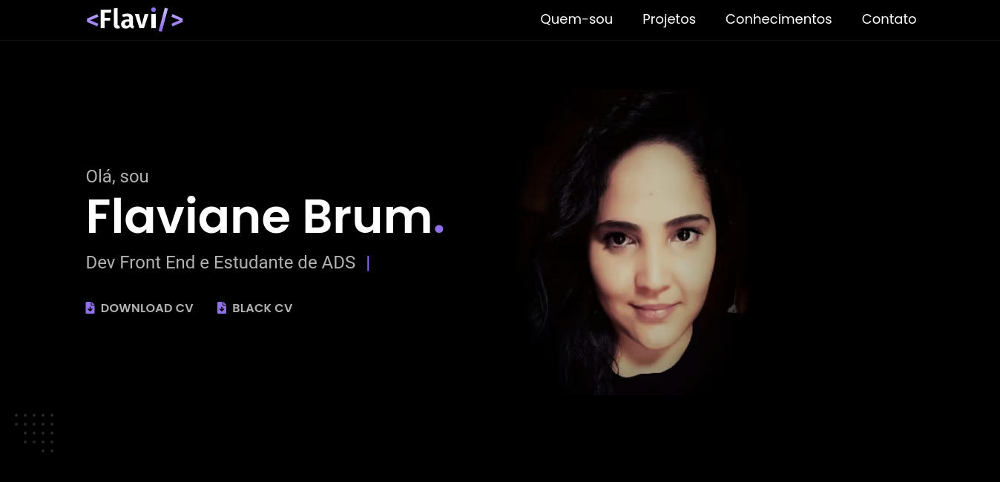

<h1 align="center">
  💻 Meu Portfólio
</h1>

<h4 align="center">
  Esta é a 2ª e mais recente versão do meu portfólio pessoal. Criado com o objetivo de apresentar um pouco sobre mim e meus conhecimentos. Além de  mostrar meus projetos no decorrer de minha carreira
</h4>

<h4 align="center"><a href="https://portfolio-flavi.vercel.app/">Clique para visitar o projeto</a></h4>

## 📚 Seções

O site é composto por 5 seções diferentes:

- **Intro:** Uma breve apresentação com meu nome e um link para meu currículo;
- **Quem sou:** Essa seção tem o objetivo de apresentar um pouco sobre mim;
- **Projetos:** Exibe alguns projetos desenvolvidos, no qual, ao clicar no respectivo projeto, abre uma página com mais informações sobre o mesmo e seu link com o código no GitHub.
- **Conhecimentos:** Nele apresento meus conhecimentos em algumas linguagens como o foco no front-end;
- **Contato:** seção com as informações de contato;

---

## 💼 Tecnologias utilizadas

Para o desenvolvimento deste site utilizei as seguintes tecnologias:

- HTML;
- CSS;
- JavaScript;
- ScrollReveal;
- Fontawesome;

---

## 🦄 Autor 

<table>
  <tr>
    <td align="center">
      <a href="https://github.com/Flaviane-Brum">
         
        
          <b>Flaviane Brum</b>
        
      </a>
    </td>
  </tr>
</table>
